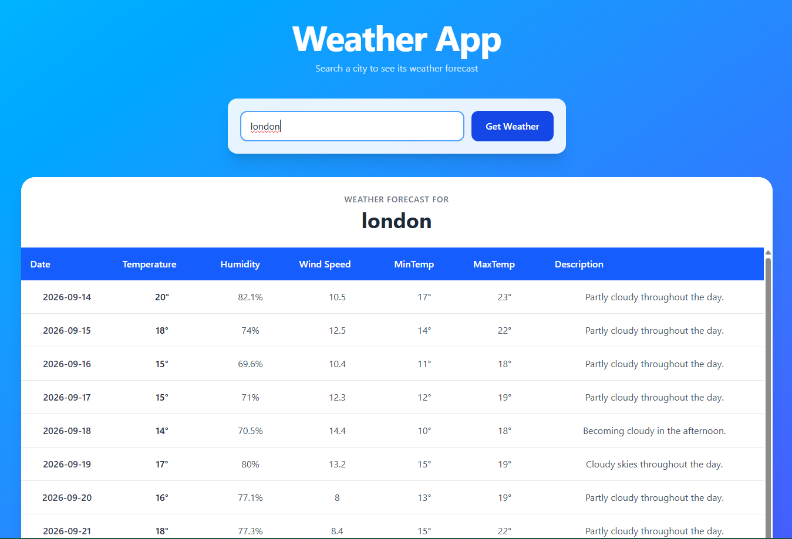

# 🌤️ Weather App

A responsive weather application built with React that allows users to search for a location and view its weather forecast using the Visual Crossing Weather API.

This project was created as part of the [roadmap.sh Weather App project](https://roadmap.sh/projects/weather-app).

---

## 🚀 Features

- 🔍 Search weather by city or location
- 🌡️ Display temperature
- 💧 Display humidity
- 💨 Display wind speed
- 🌦️ Display weather conditions
- 📝 Display weather description
- 📅 Display daily weather forecast
- ❌ Handle invalid locations and API errors
- 📱 Responsive design for different screen sizes
- ✨ Smooth UI animations
- ⌨️ Press Enter to search
- 🔄 Search for different locations without refreshing the page

---

## 🛠️ Technologies Used

- **React** – Frontend library
- **JavaScript** – Application logic
- **Tailwind CSS** – Styling and responsive design
- **Visual Crossing Weather API** – Weather data
- **Motion for React** – UI animations
- **Vite** – Development and build tool

---

## 📸 Preview

Add a screenshot of your application here.

```md
